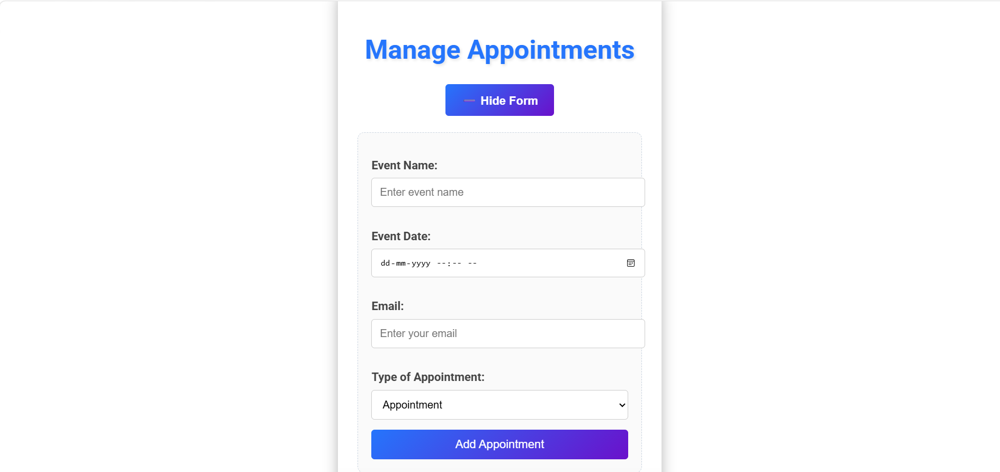
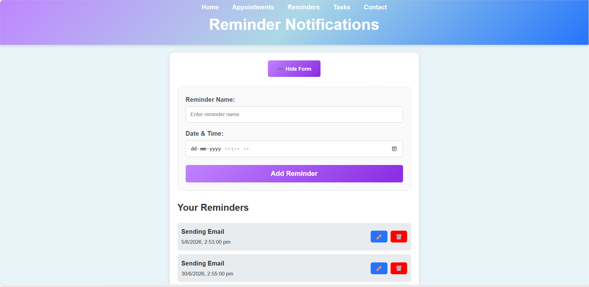
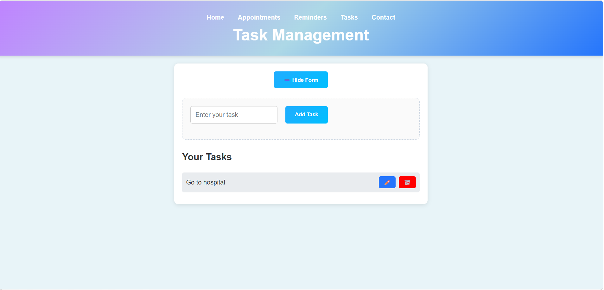

# 🤖 AI Receptionist

<p align="center">


</p>

<p align="center">
An AI-powered virtual receptionist that helps users efficiently manage appointments, reminders, and daily tasks through an intuitive web interface.
</p>

---

# 📖 Project Overview

**AI Receptionist** is a smart virtual assistant developed to simplify day-to-day scheduling and task management.

The application enables users to:

- 📅 Schedule appointments
- ⏰ Set reminders
- ✅ Manage daily tasks
- 📋 View upcoming appointments
- 🤖 Experience an AI-inspired receptionist interface

The goal of this project is to improve productivity by organizing appointments and reminders in one centralized system.

---

# ✨ Features

- 🤖 AI Receptionist Dashboard
- 📅 Appointment Scheduling
- 📝 Create New Appointments
- 📋 View Existing Appointments
- ⏰ Reminder Management
- ✅ Daily Task Management
- ✏️ Edit and Delete Records
- 💻 Responsive User Interface
- 🎨 Modern UI Design

---

# 🎯 Objectives

- Simplify appointment scheduling
- Organize reminders efficiently
- Improve personal productivity
- Reduce missed meetings and deadlines
- Provide an easy-to-use virtual receptionist system

---

# ⚙️ Modules

### 🏠 Home

Provides an overview of the AI Receptionist and its major features.

### 📅 Appointment Management

- Add new appointments
- View upcoming appointments
- Edit appointments
- Delete appointments

### ⏰ Reminder Management

- Create reminders
- Update reminders
- Delete reminders

### ✅ Task Management

- Add daily tasks
- Edit tasks
- Remove completed tasks

---

# 🛠️ Tech Stack

## Frontend

- HTML5
- CSS3
- JavaScript

## Backend

- Python

## Database

- SQLite / MySQL *(Update according to your project)*

## Version Control

- Git
- GitHub

---

# 📂 Project Structure

```text
AI-Receptionist/
│
├── frontend/
├── backend/
├── Screenshots/
│   ├── Home page.png
│   ├── NewAppointment.png
│   ├── Existing Appointments.png
│   ├── Remainder.png
│   └── To-do-task.png
│
├── README.md
└── requirements.txt
```

---

# 📸 Application Screenshots

## 🏠 Home Page

<p align="center">

</p>

The landing page introduces the AI Receptionist and highlights its core features:

- Smart Scheduling
- Intelligent Reminders
- Task Management

---

## ➕ New Appointment

<p align="center">

</p>

Users can create appointments by entering:

- Event Name
- Date & Time
- Email Address
- Appointment Type

---

## 📅 Existing Appointments

<p align="center">

</p>

Displays all scheduled appointments with options to:

- Edit Appointment
- Delete Appointment
- View Upcoming Events

---

## ⏰ Reminder Management

<p align="center">

</p>

The reminder module allows users to:

- Add reminders
- Edit reminders
- Delete reminders
- Track upcoming reminder notifications

---

## ✅ Task Management

<p align="center">

</p>

Users can efficiently manage daily tasks by:

- Adding tasks
- Updating tasks
- Deleting completed tasks

---

# 🚀 Installation

## Clone Repository

```bash
git clone https://github.com/bhargavi4470/AI-Recptionalist.git

cd AI-Recptionalist
```

---

## Install Dependencies

```bash
pip install -r requirements.txt
```

---

## Run the Application

```bash
python app.py
```

or

```bash
python main.py
```

*(Use whichever file starts your application.)*

---

# 🔄 System Workflow

```text
User
   │
   ▼
AI Receptionist Dashboard
   │
   ├──────────────┐
   │              │
   ▼              ▼
Appointments   Reminders
   │              │
   └──────┬───────┘
          ▼
     Task Management
          │
          ▼
 Organized Daily Schedule
```

---

# 🚀 Future Enhancements

- 🤖 AI Chat Assistant
- 📧 Email Notifications
- 📱 Mobile Responsive Design
- ☁️ Cloud Deployment
- 🔔 Push Notifications
- 📅 Calendar Integration
- 🎤 Voice Assistant Support

---

# 👩‍💻 Developed By

**Mangam Sai Ram Bhargavi**

**GitHub:**  
https://github.com/bhargavi4470


---

# ⭐ Support

If you found this project useful, consider giving it a ⭐ on GitHub.

Your support encourages future improvements and open-source contributions.

---
